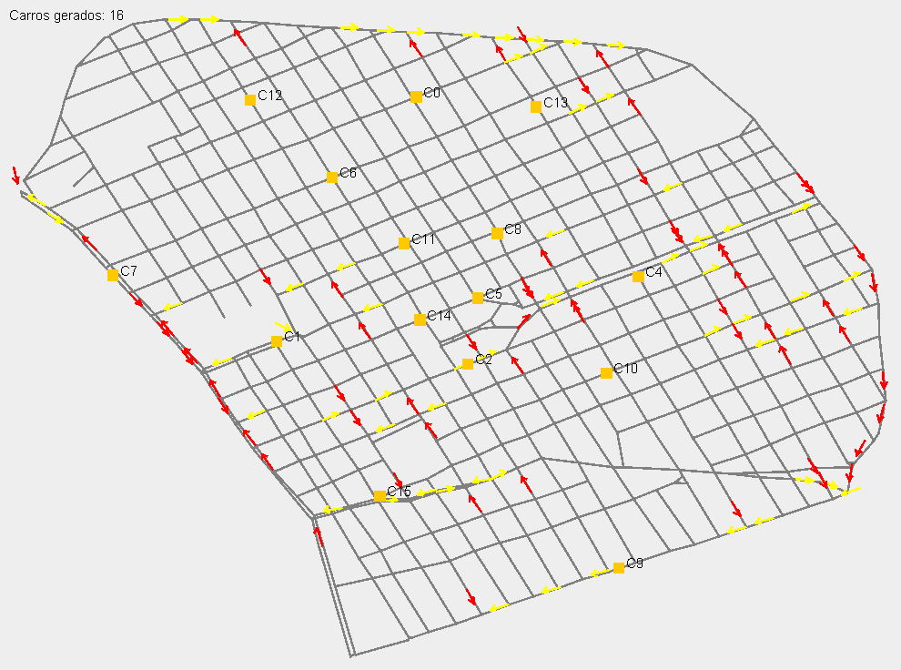

# 🚦 Simulador de Tráfego Urbano com Controle de Semáforos



Este projeto é um simulador de tráfego urbano implementado em Java, que utiliza estruturas de grafos para representar o mapa da cidade, simula veículos em movimento e implementa controle inteligente de semáforos. O sistema é ideal para fins educacionais e experimentações com algoritmos de mobilidade urbana.

## 📌 Funcionalidades

- Modelagem do ambiente urbano como grafo direcionado
- Geração automática e movimentação de veículos
- Controle sincronizado de semáforos com lógica de ciclo
- Interface gráfica com visualização em tempo real
- Carregamento dinâmico de mapas a partir de arquivos `.json`

---

## 🗺️ Modelagem do Sistema

### Estrutura de Grafo

- **Node**: representa cruzamentos ou pontos de interesse, contendo identificação e coordenadas (latitude e longitude).
- **Edge**: representa ruas entre os nós, contendo origem, destino e comprimento da via.
- O grafo é carregado dinamicamente via **Gson**, a partir de um arquivo `.json`.

### Estruturas Auxiliares

- `ListaEncadeada<T>`: lista ligada implementada manualmente.
- `Set<Edge>`: evita duplicação de controle em ruas com semáforos.

---

## 🚦 Lógica dos Semáforos

1. **Identificação de interseções**:
   - Semáforos são posicionados com base em coordenadas do arquivo `TrafficLight.json`.
   - Nós próximos são agrupados para representar cruzamentos reais.

2. **Filtragem de Ruas**:
   - Ruas com menos de 15 metros são ignoradas.
   - Cada rua válida recebe um semáforo associado.

3. **Agrupamento e Sincronização**:
   - Ruas verticais e horizontais são agrupadas em ciclos alternados.
   - O controle alterna a cada 8 ticks, evitando conflitos de tráfego.

---

## 🚗 Geração e Movimentação de Veículos

- Veículos são objetos `Carro`, instanciados em intervalos regulares via `javax.swing.Timer`.
- Cada carro escolhe um caminho aleatório no grafo e se movimenta por **interpolação linear** entre os nós.
- Os carros respeitam os semáforos, parando no vermelho e seguindo no verde.

---

## 🎨 Visualização

A interface gráfica é implementada pela classe `GrafoViewer`, baseada em `JPanel`, com:

- Ruas desenhadas como linhas cinzas
- Semáforos com setas coloridas (verde, amarelo, vermelho)
- Veículos como quadrados laranja
- Exibição opcional de coordenadas e nomes dos nós

A interface é atualizada com `repaint()` para refletir o estado atual do sistema.

---

## ✨ Resultados Esperados

- Simulação fluida e fiel de interseções urbanas com vias bidirecionais
- Transições de semáforo suaves e seguras
- Lógica adaptável a diferentes tipos de cruzamentos

---

## 🛠️ Tecnologias Utilizadas

- **Java** (Swing)
- **Gson** para parsing de JSON
- **Estruturas de Dados customizadas** (grafo, lista ligada)
- **Padrões de projeto**: Observer, Listener

---

## 📁 Estrutura do Projeto (exemplo)

src/
├── cidade/
│   ├── Aresta.java
│   ├── CentroTeresinaPiauiBrazil.json
│   ├── Edge.java
│   ├── Grafo.java
│   ├── GraphData.java
│   ├── JoqueiTeresinaPiauiBrazil.json
│   ├── Node.java
│   ├── teste1.json
│   ├── TrafficLight.java
│   └── Vertice.java
│
├── Estruturas/
│   ├── Dijkstra.java
│   ├── FilaEncadeada.java
│   ├── ListaEncadeada.java
│   ├── No.java
│   └── PilhaEncadeada.java
│
├── Interface/
│   └── GrafoViewer.java
│
├── listener/
│   └── Listener.java
│
├── semaforo/
│   ├── ControladorSemaforo.java
│   └── Semaforo.java
│
├── veiculos/
│   ├── Carro.java
│   └── ControladorCarros.java
│
├── Main.java
└── Simulador.java

## 📋 Como Executar

1. Clone o repositório:
   ```bash
   git clone https://github.com/seu-usuario/seu-repositorio.git
